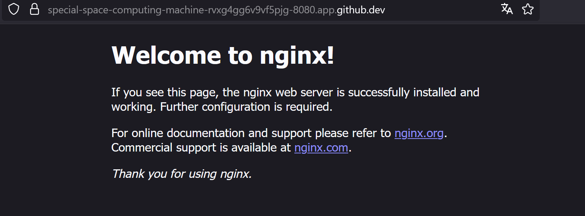

## Fichier de suivi du TP sur Docker 

Le travail à été réalisé sur Codespaces.

# Exercice 1
Pas d'installation nécessaire grace à Codespaces.

# Exercice 3

Tâches faites :
1. Vérifier la version de Docker :
docker --version

2. Lister les images disponibles sur votre machine :
docker images

3. Télécharger une image depuis Docker Hub :
docker pull hello-world

4. Exécuter un conteneur à partir de l'image :
docker run hello-world

5. Lister les conteneurs en cours d'exécution :
docker ps

6. Lister tous les conteneurs (actifs et stoppés) :
docker ps -a

7. Supprimer un conteneur :
docker rm <ID_conteneur>

8. Supprimer une image :
docker rmi <ID_image>

# Exercice 4 : serveur web

1. Télécharger l'image officielle Nginx :
docker pull nginx

2. Lancer un conteneur Nginx en arrière-plan :
docker run -d -p 8080:80 --name mon_nginx nginx

3. Vérifier que le conteneur est actif :
docker ps

4. Accéder à la page dans votre navigateur pour voir la page par défaut de Nginx.

5. Arrêter le conteneur :
docker stop mon_nginx

